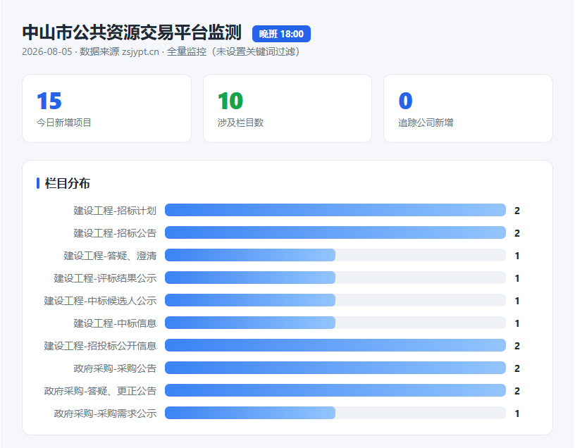
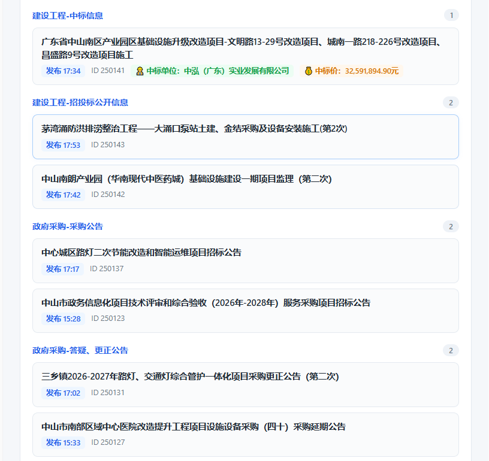

# zsjypt-monitor

中山市公共资源交易平台（[www.zsjypt.cn](https://www.zsjypt.cn)）招标信息监控工具。自动抓取「建设工程」「政府采购」共 14 个栏目的新上架项目，支持关键词追踪、多平台推送（飞书 / 企业微信 / 钉钉）与可视化看板。

> zsjypt = 中山公共资源交易平台。项目监控范围涵盖建设工程 9 个栏目与政府采购 5 个栏目，覆盖招标计划、公告、中标、澄清等全流程节点。

## ✨ 功能特性

- **全栏目增量检测**：每次运行对比上次快照（`scripts/memory/zsjypt_last.json`），识别新增项目，按 ID 去重。
- **关键词追踪**：对全部栏目做全文匹配，命中即预警。关注词在首次配置（`init`）时由你自定义，保存在 `config/user-config.json`（私有，不提交）；也可用 `track` / `untrack` 动态维护。
- **多平台推送**：`notify.py` 统一适配飞书 / 企业微信 / 钉钉群机器人报文，填入 Webhook 即启用，留空自动跳过。
- **可视化看板**：`make_dashboard.py` 生成实时看板（`reports/live/dashboard.html`），可一键导出单文件分享版。
- **自动化班次**：WorkBuddy 自动化在工作日午班（12:00）、晚班（18:00）自动运行；晚班是有效汇报窗口（平台新条目多集中在 14:00–17:30）。
- **强制直连**：脚本内置 `proxies={'http':None,'https':None}`，绕过环境不稳定的系统代理，避免抓取失败。

## 📁 目录结构

```
zsjypt-monitor/
├── .gitignore
├── LICENSE                 # MIT
├── README.md
├── CHANGELOG.md
├── requirements.txt        # requests + beautifulsoup4
├── skill.md                # WorkBuddy skill 定义（frontmatter + 用法）
├── config/
│   ├── notify.example.json      # 推送配置模板（复制为 notify.json 后填 Webhook）
│   └── user-config.example.json # 用户私有配置模板（复制为 user-config.json 填关键词）
├── scripts/
│   ├── crab-monitor.py     # 主脚本：抓取 + 增量 + 追踪 + 汇报
│   ├── notify.py           # 多平台推送（飞书/企业微信/钉钉）
│   ├── make_dashboard.py   # 可视化看板生成
│   ├── doctor.py           # 环境自检（离线）
│   └── memory/             # 运行时快照（不提交）
│       ├── zsjypt_last.json       # 全量项目快照
│       └── zsjypt_tracking.json   # 追踪关键词状态
├── references/             # skill 详细文档（按需加载）
│   ├── columns.md          # 14 栏目与抓取机制
│   ├── deploy.md           # CloudStudio 部署
│   └── notify.md           # 推送配置详解
└── reports/                # 生成的看板（不提交）
```

## 🧰 环境要求

- Python 3.10+
- 依赖：`requests`、`beautifulsoup4`

```bash
pip install -r requirements.txt
```

运行前可用 `python scripts/doctor.py` 做离线环境自检（依赖 / 配置 / 推送状态，密钥绝不打印）。

## 🚀 快速开始

```bash
# 1. 克隆/进入仓库
cd zsjypt-monitor

# 2. （可选）配置推送：复制模板并填入真实 Webhook
cp config/notify.example.json config/notify.json
#   编辑 config/notify.json，替换 feishu/wecom/dingtalk 的 webhook 字段；
#   也可用环境变量 ZS_NOTIFY_FEISHU / ZS_NOTIFY_WECOM / ZS_NOTIFY_DINGTALK 覆盖。

# 3. 运行一次日常汇报（午/晚班各跑一次即可）
python scripts/crab-monitor.py
```

## 📖 命令行用法（crab-monitor.py）

| 命令 | 说明 |
|------|------|
| `python scripts/crab-monitor.py` | 日常汇报：抓取全栏目，输出新增 + 追踪命中 |
| `python scripts/crab-monitor.py track <关键词>` | 添加关注关键词（全文匹配，覆盖全部栏目） |
| `python scripts/crab-monitor.py untrack <关键词>` | 移除关注关键词 |
| `python scripts/crab-monitor.py list` | 列出当前所有关注关键词 |

示例：

```bash
python scripts/crab-monitor.py track 示例公司
python scripts/crab-monitor.py list
python scripts/crab-monitor.py untrack 示例公司
```

> 普通汇报当前为全量新增（不过滤设计/勘察），追踪则覆盖全部项目类型，二者互补。

## 🔔 推送配置（notify.json）

`config/notify.json` 结构（`notify.example.json` 同款占位符）：

```json
{
  "feishu":  { "webhook": "https://open.feishu.cn/open-apis/bot/v2/hook/xxxx", "secret": "" },
  "wecom":   { "webhook": "https://qyapi.weixin.qq.com/cgi-bin/webhook/send?key=xxxx", "secret": "" },
  "dingtalk":{ "webhook": "https://oapi.dingtalk.com/robot/send?access_token=xxxx", "secret": "" }
}
```

- 把对应平台 `webhook` 替换为真实地址即启用；保留占位符或留空则自动跳过该平台。
- 飞书 / 钉钉开启「加签」时填 `secret`。
- 脚本末尾自动调用推送，失败安全（有配置才推，失败不影响主流程）。

## 📊 可视化看板

```bash
# 生成/更新实时看板（reports/live/dashboard.html 会随抓取自动刷新数据）
python scripts/make_dashboard.py

# 导出单文件分享版（便于发给他人，无需本地服务）
python scripts/make_dashboard.py --standalone
```

效果示意（2026-08-05 晚班数据）：





> 截图仅作展示。实际面板内容会随 `config/user-config.json` 的过滤关键词与 `scripts/memory/zsjypt_tracking.json` 的追踪设置动态变化。

## ⏰ 自动化（WorkBuddy）

WorkBuddy 自动化已部署两个班次（工作日 ACTIVE）：

| 班次 | 时间 | 备注 |
|------|------|------|
| 午班 | 12:00 | 当日新增通常尚少（平台条目多发于下午） |
| 晚班 | 18:00 | **有效汇报窗口**，建议以晚班为准 |

> 当前推送未配置 Webhook，自动化暂不推送。填入 `config/notify.json` 后即自动生效。

## 🗂 数据存储

| 文件 | 作用 | 是否入版本库 |
|------|------|-------------|
| `scripts/memory/zsjypt_last.json` | 全量项目快照（每次运行更新，去重基线） | 否（运行时生成） |
| `scripts/memory/zsjypt_tracking.json` | 追踪关键词及已知命中基线 | 否 |
| `reports/` | 历次报告与看板 HTML | 否 |
| `config/notify.json` | 推送配置（真实 Webhook） | 否（私有） |
| `config/user-config.json` | 用户过滤关键词 + 追踪词 | 否（私有） |
| `config/notify.example.json` | 推送配置模板 | 是 |
| `config/user-config.example.json` | 用户配置模板 | 是 |
| `references/` | skill 详细文档（按需加载） | 是 |

## ⚠️ 注意事项

- **发布时间窗**：平台新条目绝大多数集中在 14:00–17:30，午班（<12:00）抓到当日新增概率极低，返回 0 条属正常而非故障；晚班才是有效汇报窗口。
- **强制直连**：代码已 `proxies={'http':None,'https':None}` 绕过环境代理，若再现 `SSLEOFError` 类抓取失败，优先怀疑隧道/代理出口而非脚本。
- **快照字段**：`zsjypt_last.json` 存规整后结构（`date` / `pub_at` 等），非原始 `arabXX` 字段。
- **代理绕过**：个别环境会注入不稳定系统代理（127.0.0.1:11719）导致全栏目失败，脚本已强制直连规避。

## 📄 许可证

[MIT License](LICENSE) © 2026 Greenerly317

---

*Last Updated: 2026-08-05*
